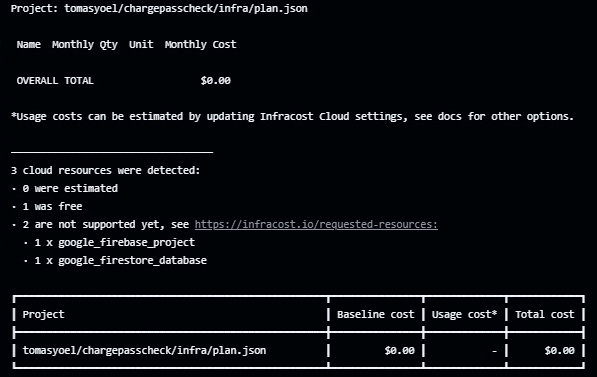

# ChargePass - Sistema Gestor de Contraseñas

## 📌 Planteamiento del Problema

En la actualidad, muchas personas utilizan contraseñas débiles, repetidas o poco seguras debido a la dificultad para recordar múltiples credenciales complejas. Esta situación incrementa el riesgo de accesos no autorizados, robo de identidad digital y vulnerabilidades en la protección de información sensible.

A pesar de que existen diversas herramientas para la gestión de contraseñas, muchas de ellas no ofrecen un proceso de autenticación previo confiable, ni garantizan una experiencia accesible y segura desde dispositivos móviles.

Además, el registro de usuarios sin una verificación adecuada puede abrir la puerta a registros fraudulentos o bots, comprometiendo la seguridad del sistema y la privacidad de los usuarios. La falta de mecanismos robustos de validación y generación segura de contraseñas limita la efectividad de estos sistemas como herramientas de protección frente a amenazas cibernéticas comunes.

## 🎯 Alcance y Justificación

**ChargePass** nace como una solución móvil moderna, segura e intuitiva que busca abordar estas limitaciones. Está diseñada para permitir a los usuarios registrar cuentas mediante verificación por correo electrónico, generar contraseñas robustas de forma automática (con criterios definidos como longitud, caracteres especiales, etc.) o manual (usando un token personalizado), y almacenarlas de manera segura en la nube.

La aplicación está construida con **Flutter** y utiliza **Firebase** como plataforma de respaldo para servicios como Firebase Auth, Firestore y Firebase Storage. Además de garantizar autenticación segura y control de acceso, el sistema contempla mejoras futuras como autenticación multifactor, validaciones por dispositivo y restricciones por dominio de correo.

Todo esto con el objetivo de proteger la identidad digital de los usuarios, evitar accesos indebidos y ofrecer una experiencia confiable desde cualquier dispositivo.

## Diagrama de Casos de Uso

### Reporte de Infracost

Diagrama de Caso de Usos Iniciar Sesión:

Registro de Usuario:

Generación Automática de Claves - Generar o guardar Contraseña:

Generación Automática de Claves - Generar o guardar Contraseña:

Diagrama de Base de Datos

Diagrama de Subsistemas:

Arquitectura lógica del sistema ChargePass a nivel de clases:

Diagrama de Secuencia : Generacion y guardado de Contraseña

Diagrama de arquitectura del Proyecto:

Diagrama de Componentes:

